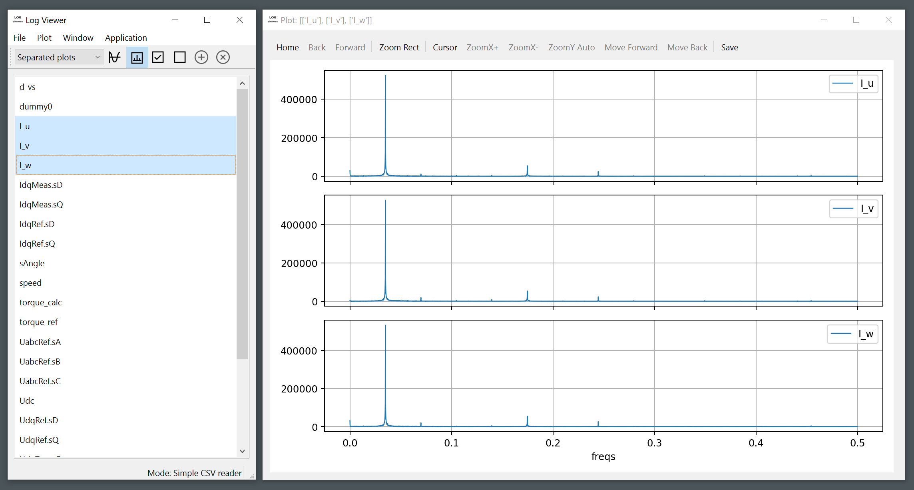
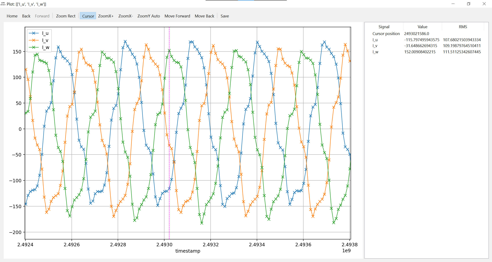

# Log Viewer

## About

Log Viewer - easy to use Qt-powered application for browsing .csv files or any [cantools](https://cantools.readthedocs.io/)-supported J1939 logs (.log/.asc/.blf/.csv).

Features:
- Intuitive user interface. There is no need to write any code just to see the log.
- Multiple plot modes (merged plot / separated / manual).
- Plotting of spectras, cursor measurements, MIN/MAX/RMS calculations, etc.




## How to run/build

To make launching/building/testing/etc easier, shell scripts for Windows/Linux have been added, located in `scripts`.

To simply launch the application, you must have Python 3.9-3.11 installed. Call `run.bat`/`run.sh` from the project root. For example:

```bat
scripts\win\run.bat
```

```bash
$ ./scripts/linux/run.sh
```

The script will create a virtual environment, if necessary (at the first launch).

If you need to build an executable file, you can do this using [pyinstaller](https://pyinstaller.org/). To do this, use `build_dist.bat`/`build_dist.sh` scripts in the same way as `run.bat`/`run.sh`. After running the script, the builded artifacts will be located in the `dist` directory.

Please note that after creating the executable file on the Windows platform, an application archive is created using [7-Zip](https://www.7-zip.org/). Install it first.

In addition, you can download precompiled releases for Windows/Linux on the [Releases](https://github.com/konstc/log_viewer/releases) page.

## How to use

There are two main modes:
- Simple CSV reader;
- J1939 dump decoder;

You can switch between them in Application->Settings->General->Mode.

### Simple CSV reader

This mode allows reading of CSV files. The settings for this mode are in Application->Settings->Simple CSV reader. You can set up an alias for the delimiter (default is ";") and a timestamp column (default is "timestamp") here. In addition, if you need to apply scaling to any column, you can specify a scaling factor here. This can be useful if you have data in relative units and want to convert it to physical units. If the specified columns ​​are not found during CSV-file processing, scaling will not be applied.

### J1939 dump decoder

In this mode, you can view logs of the following formats:
- [canutils](https://github.com/linux-can/can-utils) files (*.log);
- ASC files (*.asc);
- BLF (Binary Logging Format, proprietary CAN log format from Vector Informatik GmbH) files (*.blf);
- CSV, containing CAN frames (*.csv).

To decode messages, please specify the databases to use in Application->Settings->J1939 dump decoder->Database setup.

When decoding, all signals from messages are placed in a list for viewing in the following form:

```
vcanX.ECUYYY.SignalZ
```

where X is the used CAN interface (0 by default), YYY - ECU's SA, SignalZ - name of the decoded signal.